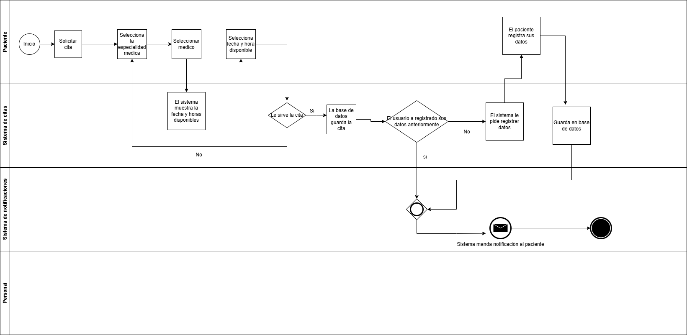

# 🗒️ Registro de Trabajo en Clase - Taller 1

## 📆 Fecha de la sesión
_2 de febrero de 2026_

## 👥 Integrantes presentes
- Tomás Ariza
- Andrés Beltrán
- Felipe Ballesteros

## 🧠 Actividades realizadas en clase

Describa brevemente qué se hizo durante la sesión:

- ¿Qué se discutió con el equipo?
```
En equipo se exploraron los diferentes símbolos de BPMN para identificar cuáles podrían servir para el modelamiento del ejemplo del agendamiento de citas médicas.

Así mismo, se discutieron el alcance y la profundidad de cada elemento dentro del modelo, por ejemplo qué realmente se considera un proceso y qué tan solo un paso que se realiza dentro de uno.

```

- ¿Qué decisiones de modelado se tomaron?
```
Inicialmente se decidió tener en cuenta el proceso de agendamiento de citas tanto virtual como presencial y las implicaciones que cada uno de estos tendría. También se tomó la decisión de modelar el caso en que los datos de la persona que agenda la cita estuvieran ausentes o incompletos en la base de datos de la entidad de salud.
```
- ¿Qué herramientas se usaron (papel, pizarra, draw.io, Astah)?
    - draw.io
- ¿Qué parte del trabajo se alcanzó a desarrollar?
```
Se alcanzó a hacer una primera versión del modelo en la que solo se contempló el agendamiento virtual de citas, y solo se alcanzó a crear el espacio para los procesos que realiza el personal de la entidad de salud como actor en el modelo. La solución se discutió con el profesor para hacer algunas correcciones frente a lo que se llevaba hasta el momento.
```

```
Se realizó una primera versión del modelo y se discutió dicha solución con el grupo y con el profesor.
```

## 🧩 Boceto inicial del modelo


## 🔁 Tareas definidas para complementar el taller

Anote las responsabilidades acordadas entre los miembros del equipo para completar la entrega final:

| Tarea asignada | Responsable | Fecha estimada |
|----------------|-------------|----------------|
| Finalización del taller en clase | Felipe Ballesteros | 13/02 |
| Modelado inicial del modelo para cliente real | Andrés Beltrán | 13/02 |
| Redacción del informe     | Felipe Ballesteros | 13/02 |
| Investigación y referencias | Tomás Ariza | 13/02 |

---

_Este documento resume el trabajo colaborativo realizado durante la sesión del taller X en el curso AREM - Universidad de La Sabana._
